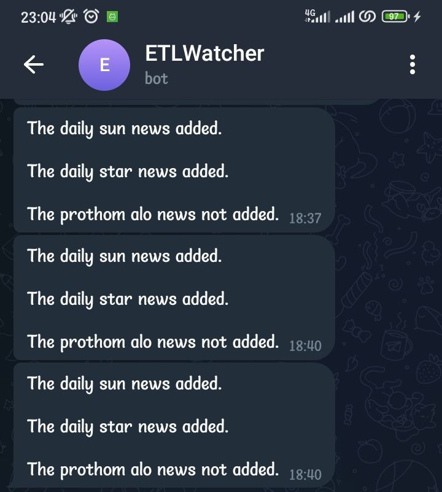

# 📰 Monitoring Automated News Summary Pipeline

This project is a real-time Telegram bot that:
- Scrapes news headlines from Bangladeshi news sources (`The Daily Sun`, `The Daily Star`, and `Prothom Alo`)
- Uses Google Gemini AI to categorize headlines and analyze whether manual intervention is needed
- Sends periodic updates to Telegram
- Accepts and answers user queries via message handler using recent context

---

## 🛠️ Features

- 🔎 Scrapes top headlines and links from 3 different news sources
- 🤖 Uses Gemini API to:
  - Categorize the headlines
  - Make decisions (e.g., whether an email should be drafted based on missing news)
  - Answer queries using the last decision context
- 📤 Sends results to Telegram every 3 minutes (can be changed)
- 💬 Accepts user queries via Telegram

---

## 📦 Project Structure

```
project/
├── extract.py            # Scraping functions for each news source
├── transfer.py           # Handles Gemini API interactions and context
├── main.py               # Main logic and bot runner
├── news.json             # Output file storing categorized headlines
├── .env                  # API keys and secrets
└── README.md             # Project overview
```

---

## 🔧 Setup Instructions

### 1. Clone the Repository

```bash
git clone https://github.com/Ataur2019331077/PipelineMonitoringBot.git
cd PipelineMonitoringBot
```

### 2. Install Requirements

```bash
pip install -r requirements.txt
```

### 3. Configure Environment Variables

Create a `.env` file with the following keys:

```env
token=YOUR_TELEGRAM_BOT_TOKEN
CHAT_ID=YOUR_TELEGRAM_CHAT_ID
GEMINI_API_KEY=YOUR_GEMINI_API_KEY
GEMINI_MODEL=gemini-pro  # or your preferred model
```

---

## ▶️ Running the Bot

```bash
python main.py
```

- Sends the first summary immediately
- Then checks every 3 minutes for updated news
- Responds to any user message using last decision context

---

## Preview


## 📥 Example Output

### Telegram Message

```
Hi Sir, I am looking that the Prothom Alo news is not added. Please check it out.
Do you want to make a draft of the mail to the corresponding person?
```

---

## 📚 Gemini Functions

### 1. `gemini_response()`
- Categorizes the list of headlines

### 2. `make_decision()`
- Checks if all news sources returned results
- Decides whether a mail draft is needed

### 3. `gemini_query()`
- Responds to user queries using last decision context

---

## 🌐 News Sources

- [The Daily Sun](https://www.daily-sun.com/)
- [The Daily Star](https://www.thedailystar.net/)
- [Prothom Alo (English)](https://en.prothomalo.com/)

---

## 🧠 Note on Gemini API

All prompts are sent to:

```
https://generativelanguage.googleapis.com/v1beta/models/YOUR_MODEL:generateContent
```

Ensure your API key and model name are set correctly in `.env`.

---

## 🧪 Sample .env File

```env
token=123456789:ABC-YourTelegramBotToken
CHAT_ID=123456789
GEMINI_API_KEY=your-gemini-api-key
GEMINI_MODEL=gemini-pro
```

---

## 📩 Contact

For issues or ideas, open an issue or create a PR.
